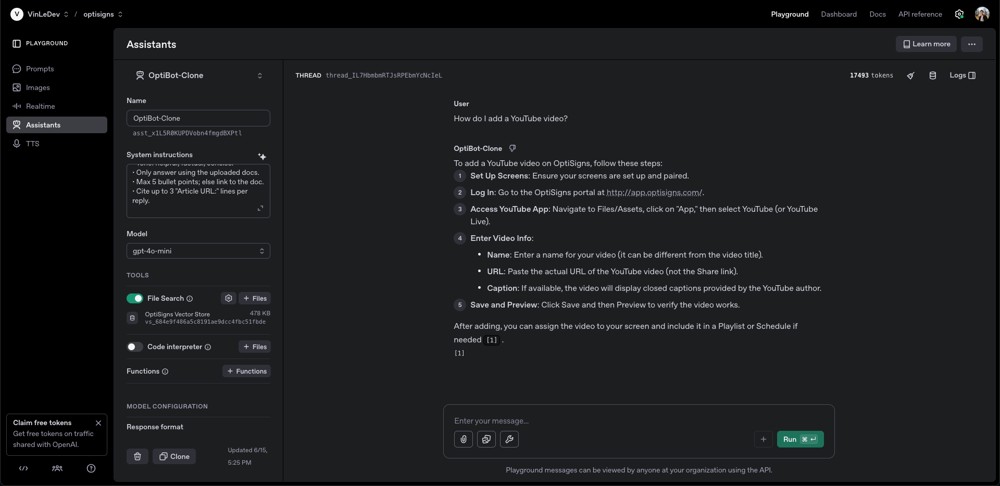

## Setup

1. Clone the repository in your desired parent directory:

   ```bash
   git clone https://github.com/vinle4/cryptic-cranberry.git
   cd cryptic-cranberry
   ```

3. Create a .env file in the root folder:
   (See .env.sample)

4. If you do not have a vector store ID yet, you can run the create_vector_store.py file. (Make sure OPENAI_API_KEY is available in your .env)

5. Follow steps to run locally on machine or locally with Docker

---

## Run Locally on Machine Once

Go into project's root directory and run the following terminal commands:

```bash
pip install -r requirements.txt
python main.py
```

---

## Run Locally With Docker Once

Make sure Docker is running and go into project's root directory then run the following terminal commands:

```bash
## If using an .env file
docker build -t cryptic-cranberry-scraper .
docker run --env-file .env cryptic-cranberry-scraper
```

---

```bash
## If using API keys directly in the run command
docker build-t cryptic-cranberry-scraper
docker run -e OPENAI_API_KEY=... DO_SPACES_KEY=... DO_SPACES_REGION=... DO_SPACES_BUCKET=... VECTOR_STORE_ID=... main.py
```

---

## Daily Job Logs

You can view logs from the scheduled job on DigitalOcean:

[DigitalOcean Job Logs](https://cryptic-cranberry.sgp1.digitaloceanspaces.com/logs/vector_upload.log)

---

## Assistant Playground Result

Below is a screenshot showing the Assistant correctly citing the source URL for the article “How to Use YouTube with OptiSigns”:



---

## Chunking Strategy

I originally began with a manual chunking strategy to create chunks after retrieving the articles and splitting the articles into parts.
However, this created inconsistent results when testing different queries/questions and citations. For example, when querying with
"How do I add a YouTube video?", it would add two citations at the bottom due to the assistant reading two different files.
Additionally, when querying with "What payment methods do you accept?", it would add null values for some items. Therefore, I stuck
with using OpenAI's auto chunking strategy.

---
